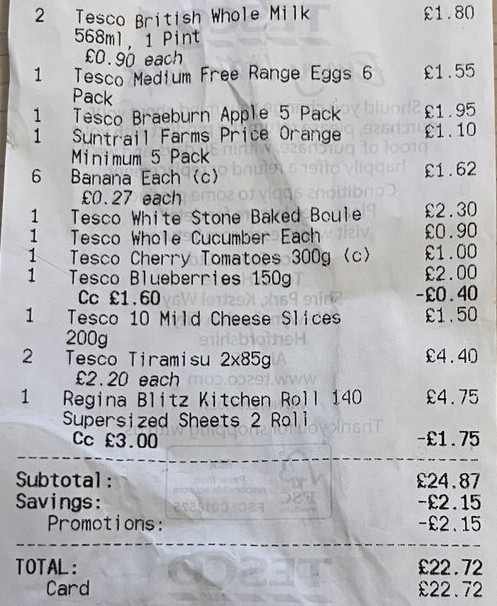

# Receipt Parser for Personal Finance & Budgeting

Project that allows to parse supermarket receipts. The goal of this project is to automate the extraction of items and their prices from the receipts, and potentially split them into budgeting categories. This project was implemented from scratch using Python and the PaddleOCR library.

---

## Features

- **Receipt Parsing**: Extract product names and prices from supermarket receipts.
- **Libraries**: Currently uses the PaddleOCR library to extract text and bounding boxes from the picture.

---

## Requirements

- Python 3.8+  
- Poetry package manager  

---
## How to Run
To install project dependencies:

```bash
poetry install
```

To run tests and see the output:
```bash
poetry run pytest
```

To run tests with detailed debug logs:
```bash
poetry run pytest --log-cli-level=DEBUG
```

---
## Example of the Parsing


[Example of the parsed output](tests/data/expected-output-test-receipt.json)
---

## License
This project is licensed under the MIT license.

---

## Todo
- Test on receipts from different supermarkets and formats
- Fix parsing bugs
- Add web UI interfaces for uploading receipts
- Add CI/CD to run tests/linters/etc
- Integrate a small LLM for automatic categorization of products